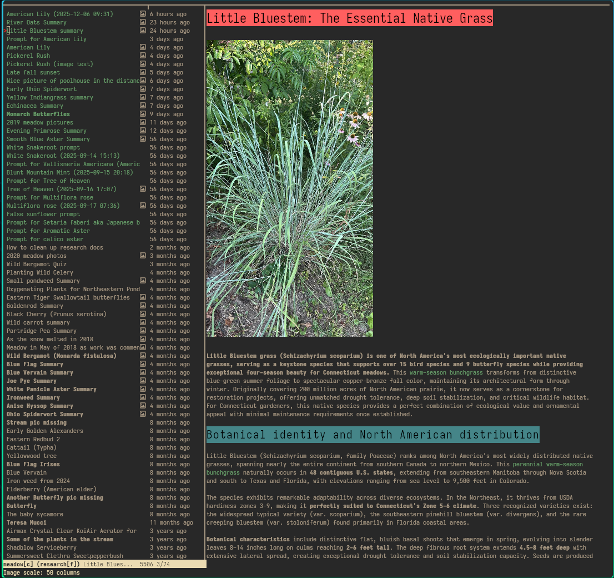

# Vimango
So this is basically an application to store notes and other documents.

The notes are stored in a local sqlite database that can be synced to a remote server so you can access and update notes from multiple devices.

There are a few semi-notable features:
- Markdown rendering of notes in the terminal based on charm's glamour package
- Images in the terminal are supported using the kitty unicode placeholder protocol
- There is specific support for pulling images from google drive. 
     - You'll need to register an application in google cloud console to get an api key for this to work
     - The markdown syntax for retrieving images from google drive is 
     - There are two ways images are cached.  During a session, images are cached in memory via kitty's standard mechanism and between sessions, images are cached on disk as scaled Base64 encoded png files
     - There are commands to clear the image cache both in memory and on disk, to scale cached images and to adjust the size of images on the screen
- Terminal Markdown rendering supports kitty's text sizing protocol
- For HTML rendering, there is a built-in webviewer that uses the go bindings to the webview library
- Syncing of notes is to a remote postgres db
- Note editing supports full vim keybindings via libvim, which was originally develeped to support the Onivim 2 editor
- There is full-text search via sqlite's fts5 extension
- Spell checking through the use of the hunspell library
- You can launch deep research via Claude and the results will be stored as a note

This wasn't developed thinking anyone else would use it so there isn't an installable package. You'll need to clone the repository and build it yourself.  There are a few dependencies that you'll need to have installed first.  These are:

 - Go 1.20 or later
 - SQLite3 development files
 - Hunspell development files
 - libvimi.a is included in the repository

The config.json file looks like this:

    "options": {
      "type": "<folder or context>",
      "title": "<name>"
    },
    "postgres": {
      "host": "",
      "port": "",
      "user": "",
      "password": "",
      "db": "vimango"
    },
    "sqlite3": {
      "db": "vimango.db",
      "fts_db":"fts5_vimango.db"
    },
    "chroma": {
      "style": "gruvbox_mod.xml"
    },
    "claude": {
      "api_key": ""
    },
    "glamour": {
      "style": "darkslz.json"
    }
  }

A few notes on the above.  Notes can be assigned two different sets of tags and for historical reasons those are contexts and folders, which are identical but let you tag a note in two different ways.  The chroma style is for syntax highlighting of code blocks in markdown notes.  The glamour style is for rendering the markdown in the terminal.  The claude api key is for accessing the anthropic's claude deep research. At the moment, the application isn't happy if there isn't a remote db to sync with but that will be addressed.

The full application makes heavy use of CGO to access various C libraries but it can be compiled without using CGO.

So if this hasn't been offputting enough, after you can clone the repository you can build as follows:

 - **Linux with CGO**: `CGO_ENABLED=1 go build --tags="fts5,cgo"` (includes libvim, hunspell, sqlite3)
 - **Linux Pure Go**: `CGO_ENABLED=0 go build --tags=fts5` (no CGO dependencies)
 - **Windows Cross-Compilation**: `GOOS=windows GOARCH=amd64 go build --tags=fts5` (pure Go only)

The main runtime options are:

 - `--help`, `-h`: Display help message with all available options and exit
 - `--go-vim`: Use pure Go vim implementation (default: CGO-based libvim)
 - `--go-sqlite`: Use pure Go SQLite driver (modernc.org/sqlite) - default
 - `--cgo-sqlite`: Use CGO SQLite driver (mattn/go-sqlite3)

If you actually manage to get the application running there is a help system:

 - `:help` - Show all available ex commands organized by category
 - `:help normal` - Show all normal mode commands organized by category
 - `:help <command>` - Show detailed help for specific ex command with usage and examples
 - `:help <key>` - Show detailed help for specific normal mode command (e.g., `:help Ctrl-H`)
 - `:help <category>` - Show all commands in a specific category (e.g., `:help Navigation`)              

 Here is a screenshot:

