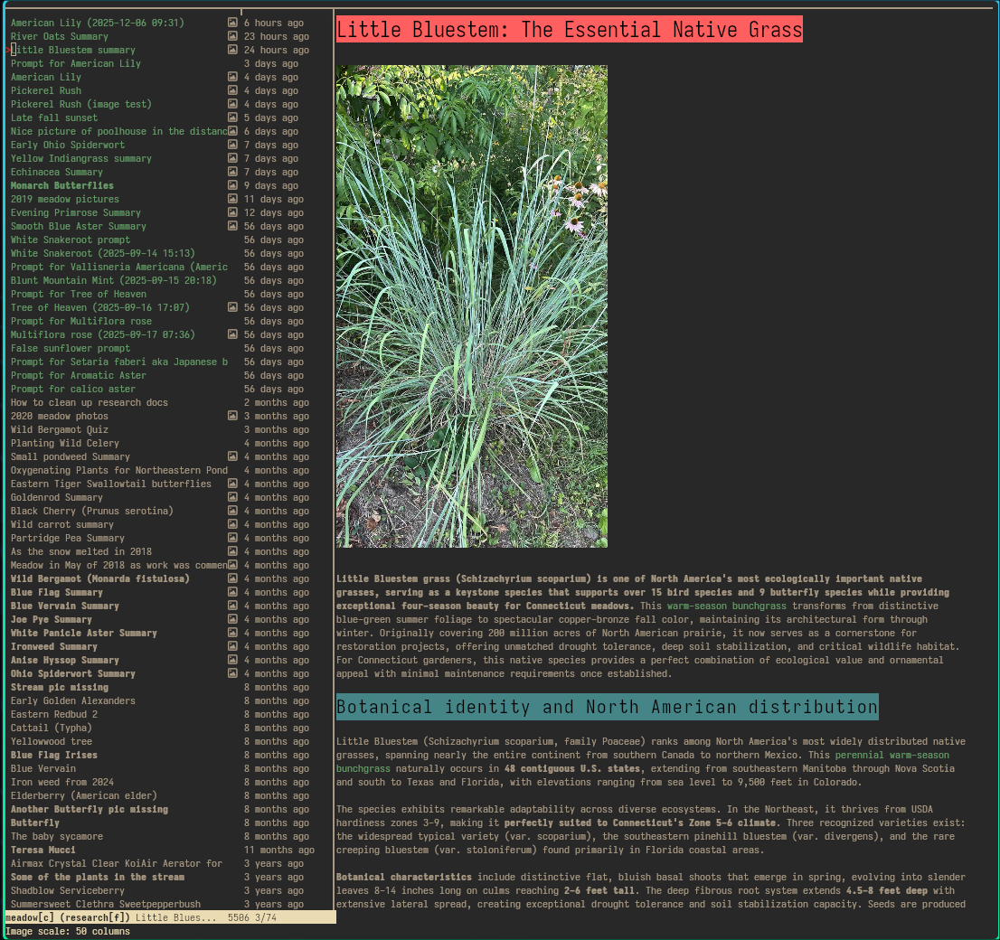

# Vimango
So this is basically an application to store notes and other documents.

The notes are stored in a local sqlite database that can be synced to a remote server so you can access and update notes from multiple devices.

There are a few semi-notable features:
- Markdown rendering of notes in the terminal based on charm's glamour package
- Images in the terminal are supported using the kitty unicode placeholder protocol
- **Google Drive image support (optional)** - Pull images directly from Google Drive into your notes
     - The markdown syntax is ``
     - Images are cached both in-memory (via kitty) and on disk (as Base64 PNG files)
     - See [Google Drive Setup](#google-drive-setup-optional) below for configuration
- Terminal Markdown rendering supports kitty's text sizing protocol
- For HTML rendering, there is a built-in webviewer that uses the go bindings to the webview library
- Syncing of notes to a remote PostgreSQL database (optional)
- Note editing supports full vim keybindings via libvim, which was originally develeped to support the Onivim 2 editor
- There is full-text search via sqlite's fts5 extension
- Spell checking through the use of the hunspell library
- You can launch deep research via Claude and the results will be stored as a note

This wasn't developed thinking anyone else would use it so there isn't an installable package. You'll need to clone the repository and build it yourself. On macOS, [MACOS_SETUP.md](./MACOS_SETUP.md) walks a completely fresh machine (no git/Homebrew/Go) through the whole setup; [INSTALL.md](./INSTALL.md) is the condensed build guide. There are a few dependencies that you'll need to have installed first.  These are:

 - Go 1.20 or later
 - SQLite3 development files
 - Hunspell development files
 - libvim.a (must be built from source — see [Building libvim.a](#building-libvima) below)
 - webkit2gtk 4.1 and GTK 3 (Linux only, for the built-in webviewer — see [Webview dependencies](#webview-dependencies) below)

## Building libvim.a

The `libvim.a` static library provides vim modal editing via CGO. It must be compiled from source because the binary differs between macOS and Linux. CGO is required: libvim is the only vim engine (the pure-Go govim engine was removed; Windows is unsupported).

**Source:** Clone [onivim/libvim](https://github.com/onivim/libvim) and build in its `src/` directory.

### macOS (Apple Silicon / Homebrew)

Install prerequisites:
```bash
brew install ncurses gettext
```

Configure and build:
```bash
cd /path/to/libvim/src
./configure --disable-selinux --with-tlib=ncurses \
  CFLAGS="-I/opt/homebrew/opt/ncurses/include -I/opt/homebrew/include \
    -Wno-error=implicit-function-declaration -Wno-error=implicit-int \
    -Wno-error=int-conversion -Wno-error=incompatible-function-pointer-types \
    -Wno-error=unused-but-set-variable -Wno-error=deprecated-non-prototype" \
  LDFLAGS="-L/opt/homebrew/opt/ncurses/lib -L/opt/homebrew/lib"
make libvim.a
```

The `-Wno-error` flags are needed because Xcode's Clang is stricter than GCC and treats certain legacy C patterns as errors.

Copy to the vimango project root:
```bash
cp libvim.a /path/to/vimango/
```

### Linux

Install prerequisites:

**Debian/Ubuntu:**
```bash
sudo apt-get install libtinfo-dev libacl1-dev
```

**Arch Linux:**
```bash
sudo pacman -S ncurses acl
```

Configure and build:
```bash
cd /path/to/libvim/src
./configure --disable-selinux --with-tlib=tinfo \
  CFLAGS="-fPIC -Wno-error=implicit-function-declaration \
    -Wno-error=implicit-int -Wno-error=int-conversion"
make libvim.a
```

The `-fPIC` flag is required on Linux for position-independent code. The `-Wno-error` flags are needed because GCC 14+ treats implicit function declarations and implicit int return types as errors, which breaks the legacy C in configure's test programs.

Copy to the vimango project root:
```bash
cp libvim.a /path/to/vimango/
```

### Build Notes

- The `libvim.a` file must be placed in the vimango project root directory (next to `go.mod`).
- You do **not** need to copy or regenerate `auto/config.h` or `auto/pathdef.c` from your libvim build; the versions checked into this repo work on both platforms.

## Building heic_worker

The CGO HEIC decoder uses a separate worker subprocess (`heic_worker`) so libheif crashes can't take down vimango. The worker binary must be built per-platform and placed alongside the main `vimango` executable. It is excluded from version control via `.gitignore`.

Install `libheif`:

- **Arch Linux:** `sudo pacman -S libheif`
- **Debian/Ubuntu:** `sudo apt-get install libheif-dev`
- **macOS:** `brew install libheif`

Build and copy:

```bash
cd cmd/heic_worker
CGO_ENABLED=1 go build -o ../../heic_worker
```

If `heic_worker` is missing or built for the wrong architecture, vimango will silently fall through HEIC images (the placeholder will not render). HEIC support is optional — non-HEIC images are unaffected, and pure Go builds use a `pillow-heif` Python fallback when `.venv` is set up (see "HEIC Image Support" below).

## Webview dependencies

The built-in HTML webviewer uses `github.com/webview/webview_go`, which on Linux/BSD links against GTK 3 and webkit2gtk 4.1. These must be installed before building:

- **Arch Linux:** `sudo pacman -S gtk3 webkit2gtk-4.1`
- **Debian/Ubuntu:** `sudo apt-get install libgtk-3-dev libwebkit2gtk-4.1-dev`
- **macOS:** no install needed — uses the native WebKit framework
- **Windows:** no install needed — uses the bundled Edge WebView2

The webview import is unconditional, so these libraries are required for any CGO build (the pure-Go cross-compiled Windows build does not need them on the build host).

A patched fork of `webview_go` lives under `third_party/webview_go` (referenced via a `replace` directive in `go.mod`) to pin the pkg-config target to `webkit2gtk-4.1`, since upstream still references the deprecated `webkit2gtk-4.0`.

## Building webview_worker

**Required on both Linux and macOS for CGO builds.** The webviewer runs in a separate `webview_worker` subprocess so its event loop can own the process's main thread (mandatory on macOS for AppKit/WebKit; correct and harmless on Linux). Like `heic_worker`, the binary differs per platform and is excluded from version control via `.gitignore`.

Install the webview platform dependencies first (see [Webview dependencies](#webview-dependencies) above), then build the worker:

```bash
cd cmd/webview_worker
CGO_ENABLED=1 go build -o ../../webview_worker
```

The worker must sit next to the main `vimango` executable (or in the current working directory). If it's missing or built for the wrong architecture, `Ctrl-W` falls back to opening the rendered note in the system browser (`open` on macOS, `xdg-open` on Linux) — graceful, but you lose the in-app live-update behavior. Worker errors are logged to `$TMPDIR/vimango_webview_worker.log`.

Builds without the worker binary always use the browser fallback.

## Quick Start

**First-time setup (recommended):**
```bash
# 1. Clone the repository
git clone https://github.com/slzatz/vimango.git
cd vimango

# 2. Build libvim.a and copy to this directory (see "Building libvim.a" above)

# 3. Build heic_worker (only if you want CGO HEIC support — see "Building heic_worker" above)
cd cmd/heic_worker && CGO_ENABLED=1 go build -o ../../heic_worker && cd ../..

# 4. Build webview_worker (required on Linux and macOS for the in-app HTML viewer — see "Building webview_worker" above)
cd cmd/webview_worker && CGO_ENABLED=1 go build -o ../../webview_worker && cd ../..

# 5. Build the application
CGO_ENABLED=1 go build --tags=fts5

# 6. Run first-time setup (creates config.json and databases)
./vimango --init

# 7. Run the application
./vimango
```

**Manual setup (alternative):**
1. Copy the example config: `cp config.json.example config.json`
2. Edit `config.json` with your settings (see below)
3. Create SQLite databases manually or let `--init` do it
4. Build: `CGO_ENABLED=1 go build --tags=fts5`
5. Run: `./vimango`

## Configuration

The `config.json` file structure (copy from `config.json.example`):

```json
{
  "options": {
    "type": "folder",
    "title": "vimango"
  },
  "postgres": {
    "host": "",
    "port": "",
    "user": "",
    "password": "",
    "db": "vimango"
  },
  "sqlite3": {
    "db": "vimango.db",
    "fts_db": "fts5_vimango.db"
  },
  "chroma": {
    "style": "gruvbox_mod.xml"
  },
  "claude": {
    "api_key": ""
  },
  "glamour": {
    "style": "darkslz.json"
  }
}

```

**Notes on configuration:**
- **options**: Notes can be tagged with both "contexts" and "folders" - two parallel tagging systems
- **postgres**: Remote sync is optional - leave empty if not using remote sync
- **sqlite3**: Local database settings - these files will be created automatically
- **chroma**: Syntax highlighting style for code blocks in markdown
- **glamour**: Markdown rendering style - `darkslz.json` and `default.json` are included
- **claude**: API key for deep research feature (optional)

The full application makes heavy use of CGO to access various C libraries (libvim, hunspell, sqlite3); CGO is required — pure-Go builds are unsupported.

So if this hasn't been offputting enough, after you can clone the repository you can build as follows:

 - `CGO_ENABLED=1 go build --tags=fts5` (the `fts5` tag is mandatory and enforced at compile time by `fts5_guard.go`; add `spell` — `--tags="fts5,spell"` — for hunspell spell check)

The main runtime options are:

 - `--help`, `-h`: Display help message with all available options and exit

If you actually manage to get the application running there is a help system:

 - `:help` - Show all available ex commands organized by category
 - `:help normal` - Show all normal mode commands organized by category
 - `:help <command>` - Show detailed help for specific ex command with usage and examples
 - `:help <key>` - Show detailed help for specific normal mode command (e.g., `:help Ctrl-H`)
 - `:help <category>` - Show all commands in a specific category (e.g., `:help Navigation`)              

## Google Drive Setup (Optional)

Google Drive integration is **optional**. The application works fine without it - you just won't be able to display images stored in Google Drive. If you try to view a `gdrive:` image without credentials configured, you'll see a message explaining how to set it up.

If you want to use Google Drive images in your notes, follow these steps:

### 1. Create a Google Cloud Project

1. Go to the [Google Cloud Console](https://console.cloud.google.com/)
2. Create a new project (or select an existing one)
3. Enable the **Google Drive API** for your project:
   - Go to "APIs & Services" → "Library"
   - Search for "Google Drive API" and enable it

### 2. Create OAuth 2.0 Credentials

1. Go to "APIs & Services" → "Credentials"
2. Click "Create Credentials" → "OAuth client ID"
3. If prompted, configure the OAuth consent screen first:
   - Choose "External" user type (unless you have a Workspace account)
   - Fill in the required fields (app name, user support email, developer email)
   - Add yourself as a test user
4. Create an OAuth client ID:
   - Application type: **Desktop app**
   - Name: "Vimango" (or whatever you prefer)
5. Download the credentials JSON file

### 3. Configure Vimango

1. Rename the downloaded file to `go_credentials.json`
2. Place it in the vimango directory (same directory as the executable)
3. Run `./vimango --gdrive-auth`. It will:
   - Print an authorization URL
   - Open the URL in your browser (or copy/paste it)
   - Sign in with your Google account and authorize the app
   - Paste the authorization code back into the terminal
4. A `token.json` file will be created to store your access token

`--gdrive-auth` is also the fix whenever the stored token stops working
(expired or revoked): it verifies `token.json` with a live API call and
re-runs the sign-in flow if needed. (Running the TUI without a `token.json`
triggers the same prompt as a side effect, but the flag is the reliable,
scriptable way in.)

### 4. Using Google Drive Images

To include a Google Drive image in a note, use the syntax:

```markdown

```

Where `FILE_ID` is the Google Drive file ID. You can find this in the file's URL:
`https://drive.google.com/file/d/FILE_ID/view`

### Security Notes

- `go_credentials.json` contains your OAuth client credentials - don't share it
- `token.json` contains your access token - don't share it
- Both files should be added to `.gitignore` (they already are in this repo)

Here is a screenshot:

